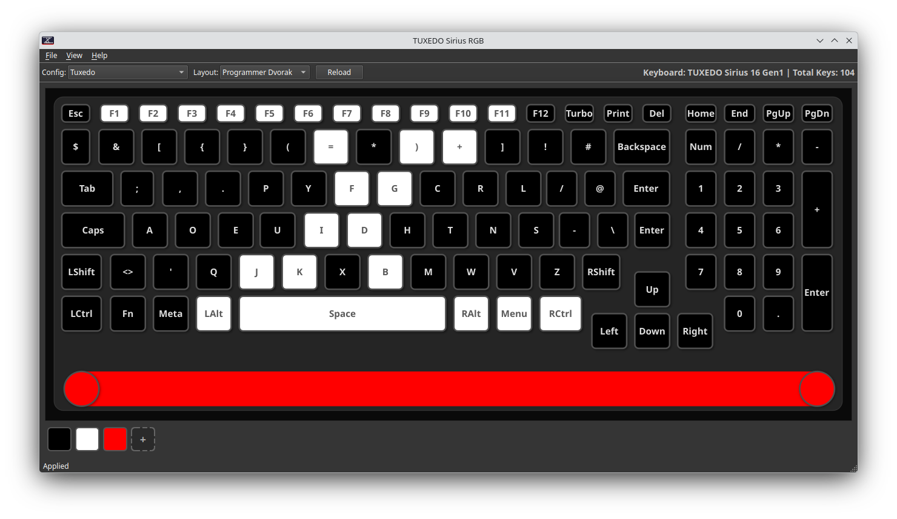
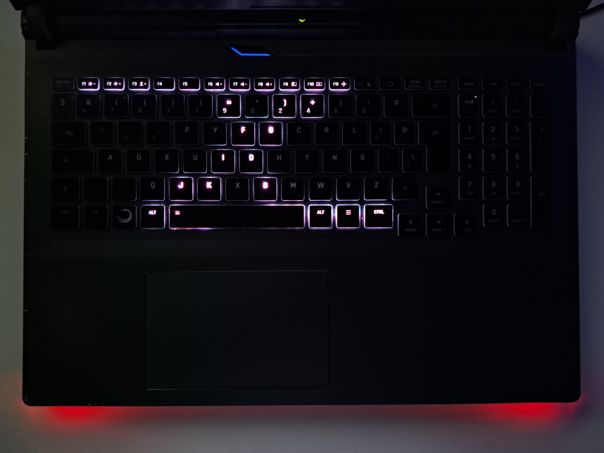

# TUXEDO Sirius Per-Key RGB — v1.0.0

Per-key RGB keyboard control for the **TUXEDO Sirius 16 Gen1** (APX958) on Linux.

A custom kernel module exposes the keyboard's WMI interface through sysfs, and a PyQt6 GUI lets you paint individual keys with any color. Your color configuration is saved to JSON and automatically restored at boot via a systemd service.





## Supported Hardware

| Model | Board | Keys | Interface |
|---|---|---|---|
| TUXEDO Sirius 16 Gen1 | APX958 | 104 (ISO) | WMI Method 6 |

Other TUXEDO NB04-based laptops with per-key RGB *may* work but are untested.

## Prerequisites

- Linux kernel headers (`linux-headers-$(uname -r)`)
- `build-essential` / `make` / `gcc`
- Python 3.10+
- Optional: `dkms` (auto-rebuilds the module on kernel updates)

## Install

```bash
git clone https://github.com/rubenyz/tuxedo-sirius-rgb.git
cd tuxedo-sirius-rgb
sudo ./install.sh
```

The installer will:
1. Build the `tuxedo_nb04_rgb_perkey` kernel module
2. Install a udev rule for non-root sysfs access
3. Create a Python virtual environment and install PyQt6
4. Install a systemd service to load the driver and apply your config at boot
5. Install a desktop menu entry
6. Optionally register with DKMS for automatic rebuilds on kernel updates

After installation, the driver is loaded and your keyboard is ready to use (no reboot required).

## Usage

### GUI Editor

Start the GUI from your application menu (look for "TUXEDO Keyboard RGB") or run:

```bash
./run_gui.sh
```

The GUI runs in the background with a system tray icon. To close it, right-click the tray icon and select "Quit".

**Features:**
- Pick a preset color at the bottom of the window
- Click individual keys to paint them
- Right-click a key to set it to black
- Switch between config profiles in the toolbar dropdown
- Colors are applied to the keyboard in real time

**Note**: When applying colors, the keyboard may flicker twice. This is because the lightbar requires a different control method (WMI Method 3), and to synchronize both subsystems, the driver makes 3 separate calls to the embedded controller (EC).

### Manual Driver Control

```bash
# Load
cd kernel && sudo make install

# Unload
cd kernel && sudo make uninstall
```

### Config Files

Color profiles are stored as JSON files in `configs/` with filenames derived from the config name (e.g., `tuxedo.json`, `my-config.json`). Each file contains a `name`, a list of HSV `presets`, and a per-key mapping. You can edit them by hand or create/duplicate them through the GUI.

### Keyboard Layouts

The GUI ships with keymaps for QWERTY (US/UK), QWERTZ (DE), AZERTY (FR), Dvorak and Programmer Dvorak. Select your layout from the dropdown in the toolbar.

To add a custom layout, create a JSON file in `layouts/keymaps/` following the existing format — it maps HID key codes to display labels.

## How It Works

1. **Kernel module** (`kernel/tuxedo_nb04_rgb_perkey.c`) registers a WMI driver and exposes `/sys/kernel/tuxedo_nb04_rgb_perkey/batch` for writing raw per-key RGB commands.
2. **Python library** (`app/kernel.py`) converts HSV color values to the WMI Method 6 packet format for the keyboard keys and uses WMI Method 3 for the lightbar zones. Both are written to sysfs.
3. **GUI** (`app/main.py`) renders the physical ISO keyboard layout from `layouts/keyboard_layout.json` (positions in micrometers) and lets you visually assign colors.
4. **Systemd service** loads the module and runs `app/apply_config.py` at boot to restore your last used config.

## Project Structure

```
├── kernel/                         # Kernel module
│   ├── tuxedo_nb04_rgb_perkey.c
│   ├── 99-tuxedo-perkey.rules
│   ├── Makefile
│   └── dkms.conf                   # DKMS configuration
├── app/
│   ├── main.py                     # PyQt6 GUI editor
│   ├── manager.py                  # Config management
│   ├── color_picker.py             # HSV color picker dialog
│   ├── kernel.py                   # Core library (kernel interface)
│   ├── apply_config.py             # Boot-time config applicator
│   ├── __version__.py              # Version information
├── assets/                         # Images and icons
│   ├── icon.svg                    # App icon
│   ├── screenshot.png              # GUI screenshot
│   └── reallife.jpeg               # Real-life photo
├── layouts/
│   ├── keyboard_layout.json        # Physical key positions (micrometers)
│   └── keymaps/                    # Keyboard layout label mappings
│       ├── qwerty-us.json
│       ├── qwerty-uk.json
│       ├── qwertz-de.json
│       ├── azerty-fr.json
│       └── dvorak.json
├── configs/
│   ├── tuxedo.json                 # Default color profile
│   └── ...                         # Additional profiles (created by GUI)
├── systemd/
│   └── tuxedo-perkey.service       # Systemd service template
├── LICENSE                         # GPL-2.0 license
├── install.sh                      # One-step installer
└── run_gui.sh                      # Launch the GUI
```

## WMI Protocol Reference

The kernel module communicates with the keyboard firmware via WMI methods.

**GUID**: `80C9BAA6-AC48-4538-9234-9F81A55E7C85`  
**Instance**: `0x00`

### Method 6 — Per-Key RGB Control

**Method ID**: `0x06` (`TUX_KBL_SET_MULTIPLE_KEYS`)

#### Input Buffer (496 bytes)

```c
struct {
    u8 reserved[15];   // Must be 0x00
    u8 key_count;      // Number of keys (0–120)
    struct {
        u8 key_id;     // HID Usage ID (0x00–0xFF)
        u8 red;
        u8 green;
        u8 blue;
    } keys[120];
} __attribute__((packed));
```

#### Output Buffer (80 bytes)

Return value in `out[0]`; remainder reserved by firmware.

Key codes follow the **USB HID Usage ID** specification (same as `keyboard_layout.json`).

### Method 3 — Lightbar Zone Control

**Method ID**: `0x03` (`TUX_KBL_SET_ZONE`)

Controls the LED lightbar on the front edge of the laptop.

#### Input Buffer (8 bytes)

```c
struct {
    u8 zone;           // 0x10 (left), 0x20 (right), 0x30 (both)
    u8 red;
    u8 green;
    u8 blue;
    u8 brightness;     // 0–255 (default 10)
    u8 reserved;       // Set to 0xFE
    u8 padding;        // Set to 0x00
    u8 enable;         // 1 = on, 0 = off (WARNING: disables entire RGB controller!)
} __attribute__((packed));
```

**Note**: Setting `enable=0` disables the entire RGB subsystem including the keyboard. To turn off the lightbar, use RGB=(0,0,0) with `enable=1`.

## Credits

- Werner Sembach — original LKML patch and HID LampArray driver
- TUXEDO Computers — hardware and WMI interface
- Anthropic Claude — development and debugging